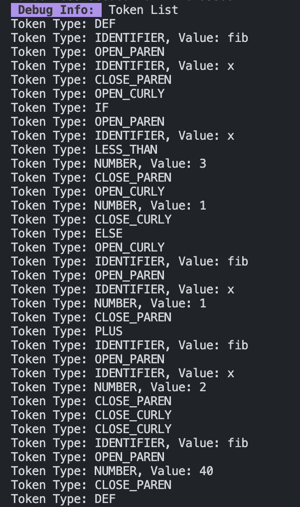
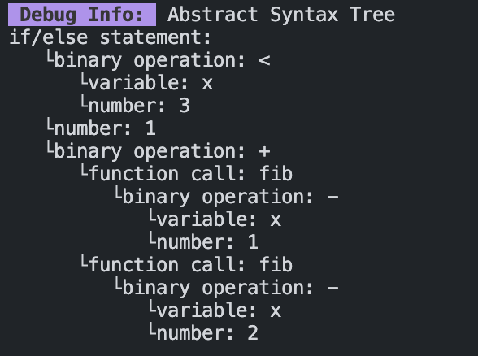
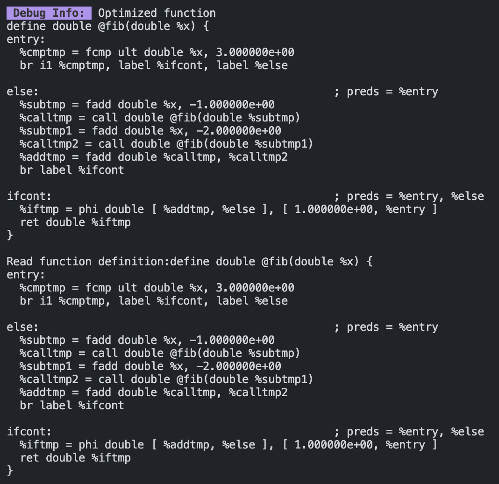

# LLVM Compiler

A custom Just-In-Time (JIT) compiler for a simplified imperative langauge built using modern C++ and the LLVM compiler infrastructure (complete pipeline from source code to native machine code execution).

Example program that recursively calculates the Fibonacci numbers:
```python
# Compute the x'th fibonacci number recursively.
def fib(x) {
  if (x < 3) {
    1
  }
  else {
    fib(x-1)+fib(x-2)
  }
}

# This expression will compute the 40th number.
fib(40)
```

### Note on naming convention:
This project is referred to in the source code as both a "Decaf" compiler and a compiler for "LaSIL" (which stands for LASA Simplified Imperative Language). The reasons for this are twofold. Firstly, the primary inspiration for this project was the "Decaf Language Reference" used in CS 432 and CS 630 at James Madison University (though the language in its current form shares several differences and is less advanced). Moreover, I first started working on this project as a part of my CS independent study during my time at LASA high school. In order to pay homage to both Decaf and my high school (where I learned a great deal), I've decided the preserve the source code as is, despite the naming inconsistencies.

## Features

* **Custom Frontend**: Hand-written lexer and recursive descent parser that transform source code into a structured Abstract Syntax Tree (AST).
* **LLVM IR Generation and Optimization**: Translates the custom AST into optimized LLVM Intermediate Representation (IR) utilizing LLVM's core API.
* **JIT Execution Engine**: Leverages `KaleidoscopeJIT` to dynamically compile and execute LLVM IR on the fly.
* **Robust Testing**: Unit tests for language features powered by Catch2.

## Project Architecture

The compiler's core components are modularized in the `src/` directory:

* `Lexer`: Reads source files and generates a stream of language tokens.

* `Parser`: Consumes tokens to build an Abstract Syntax Tree (AST).

* `CodeGenerator`: Traverses the AST and emits optimized LLVM IR using several passes.

* `Logger`: Extensive logging subsystem with helper functions to pretty print the list of tokens generated by the Lexer and recursively output the AST.
* `JIT`: Manages the LLVM execution engine for runtime compilation.

## Prerequisites

This project is configured for macOS (Apple Silicon/ARM64) environments. Ensure you have the following installed:

* **CMake** (v3.5+)
* **C++20** compatible compiler (e.g., Clang)
   * Specify by changing CMAKE_CXX_COMPILER in `CMakeLists.txt`
* **LLVM**: The LLVM development package, last tested using version 22.1.5
* **libedit** (install via `brew install libedit`)
* **Catch2**: Automatically fetched by CMake during configuration.

*(Note: The Catch2 testing framework is automatically fetched by CMake).*

### Installation of LLVM
This is how I installed LLVM using homebrew for a working build (as of 05/13/2026):
* `brew install llvm`

If you need to have llvm first in your PATH, run: `echo 'export PATH="/opt/homebrew/opt/llvm/bin:$PATH"' >> ~/.zshrc`

For compilers to find llvm you may need to set: `export LDFLAGS="-L/opt/homebrew/opt/llvm/lib"` and `export CPPFLAGS="-I/opt/homebrew/opt/llvm/include"`

**For cmake to find llvm you may need to set:** `export CMAKE_PREFIX_PATH="/opt/homebrew/opt/llvm"`

The build will likely break as LLVM gets updated (in fact I had a change a few lines to get it to work at the time of writing this since I haven't touched it in almost year). Consequently, prepare to change a few lines of code or downgrade your version of LLVM. As mentioned, this was last tested for version 22.1.5 on MacOS (installed via homebrew).

## Build Instructions

1. Navigate into the project directory:
   ```bash
   cd LLVM-Compiler
   ```

2. Create a build directory and configure the project with CMake:
   ```bash
   mkdir build && cd build
   cmake ..
   ```

3. Build the executable:
   ```bash
   make
   ```

## Usage

By default, the compiled executable (`decaf_cc`) acts as a test runner for the Catch2 suite. 

To run the built-in compiler tests:
```bash
./decaf_cc
```

*Note: The primary entry point in `src/main.cpp` is currently configured for testing. To compile and execute standalone `.decaf` source files, you can uncomment the CLI file-parsing logic in `main.cpp`.*

## Example Run
The output should be as follows:

```
➜  build git:(main) ✗ ./decaf_cc
Randomness seeded to: 1796463656
Debug Info:  Token List
Token Type: DEF
Token Type: IDENTIFIER, Value: fib
Token Type: OPEN_PAREN
Token Type: IDENTIFIER, Value: x
Token Type: CLOSE_PAREN
Token Type: OPEN_CURLY
Token Type: IF
Token Type: OPEN_PAREN
Token Type: IDENTIFIER, Value: x
Token Type: LESS_THAN
Token Type: NUMBER, Value: 3
Token Type: CLOSE_PAREN
Token Type: OPEN_CURLY
Token Type: NUMBER, Value: 1
Token Type: CLOSE_CURLY
Token Type: ELSE
Token Type: OPEN_CURLY
Token Type: IDENTIFIER, Value: fib
Token Type: OPEN_PAREN
Token Type: IDENTIFIER, Value: x
Token Type: NUMBER, Value: 1
Token Type: CLOSE_PAREN
Token Type: PLUS
Token Type: IDENTIFIER, Value: fib
Token Type: OPEN_PAREN
Token Type: IDENTIFIER, Value: x
Token Type: NUMBER, Value: 2
Token Type: CLOSE_PAREN
Token Type: CLOSE_CURLY
Token Type: CLOSE_CURLY
Token Type: IDENTIFIER, Value: fib
Token Type: OPEN_PAREN
Token Type: NUMBER, Value: 40
Token Type: CLOSE_PAREN
Token Type: DEF
Line 293 ran!
Token Type: IDENTIFIER, Value: fib
Line 265 ran!
Token Type: OPEN_PAREN
Line 270 ran!
Token Type: IDENTIFIER, Value: x
Line 279 ran!
Token Type: CLOSE_PAREN
Line 285 ran!
Token Type: OPEN_CURLY
Line 303 ran!
Token Type: IF
Line 126 ran!
Token Type: OPEN_PAREN
Line 129 ran!
Parse identifier expression
Token Type: IDENTIFIER, Value: x
Line 82 ran!
Parse binary expression
Token Type: LESS_THAN
Line 235 ran!
Parse number expression
Token Type: NUMBER, Value: 3
Line 47 ran!
Token Type: CLOSE_PAREN
Line 138 ran!
Token Type: OPEN_CURLY
Line 143 ran!
Parse number expression
Token Type: NUMBER, Value: 1
Line 47 ran!
Parse binary expression
Token Type: CLOSE_CURLY
Line 151 ran!
Token Type: ELSE
Line 157 ran!
Token Type: OPEN_CURLY
Line 161 ran!
Parse identifier expression
Token Type: IDENTIFIER, Value: fib
Line 82 ran!
Token Type: OPEN_PAREN
Line 90 ran!
Parse identifier expression
Token Type: IDENTIFIER, Value: x
Line 82 ran!
Parse binary expression
Line 235 ran!
Parse number expression
Token Type: NUMBER, Value: 1
Line 47 ran!
why this no run :(
Token Type: CLOSE_PAREN
Line 115 ran!
Parse binary expression
Token Type: PLUS
Line 235 ran!
Parse identifier expression
Token Type: IDENTIFIER, Value: fib
Line 82 ran!
Token Type: OPEN_PAREN
Line 90 ran!
Parse identifier expression
Token Type: IDENTIFIER, Value: x
Line 82 ran!
Parse binary expression
Line 235 ran!
Parse number expression
Token Type: NUMBER, Value: 2
Line 47 ran!
why this no run :(
Token Type: CLOSE_PAREN
Line 115 ran!
Token Type: CLOSE_CURLY
Line 170 ran!
Parse binary expression
Token Type: CLOSE_CURLY
Line 311 ran!
 Debug Info:  Abstract Syntax Tree
if/else statement: 
   └binary operation: <
      └variable: x
      └number: 3
   └number: 1
   └binary operation: +
      └function call: fib
         └binary operation: -
            └variable: x
            └number: 1
      └function call: fib
         └binary operation: -
            └variable: x
            └number: 2

 Debug Info:  Unoptimized function
define double @fib(double %x) {
entry:
  %cmptmp = fcmp ult double %x, 3.000000e+00
  %booltmp = uitofp i1 %cmptmp to double
  %ifcond = fcmp one double %booltmp, 0.000000e+00
  br i1 %ifcond, label %then, label %else

then:                                             ; preds = %entry
  br label %ifcont

else:                                             ; preds = %entry
  %subtmp = fsub double %x, 1.000000e+00
  %calltmp = call double @fib(double %subtmp)
  %subtmp1 = fsub double %x, 2.000000e+00
  %calltmp2 = call double @fib(double %subtmp1)
  %addtmp = fadd double %calltmp, %calltmp2
  br label %ifcont

ifcont:                                           ; preds = %else, %then
  %iftmp = phi double [ 1.000000e+00, %then ], [ %addtmp, %else ]
  ret double %iftmp
}

 Debug Info:  Optimized function
define double @fib(double %x) {
entry:
  %cmptmp = fcmp ult double %x, 3.000000e+00
  br i1 %cmptmp, label %ifcont, label %else

else:                                             ; preds = %entry
  %subtmp = fadd double %x, -1.000000e+00
  %calltmp = call double @fib(double %subtmp)
  %subtmp1 = fadd double %x, -2.000000e+00
  %calltmp2 = call double @fib(double %subtmp1)
  %addtmp = fadd double %calltmp, %calltmp2
  br label %ifcont

ifcont:                                           ; preds = %entry, %else
  %iftmp = phi double [ %addtmp, %else ], [ 1.000000e+00, %entry ]
  ret double %iftmp
}

Read function definition:define double @fib(double %x) {
entry:
  %cmptmp = fcmp ult double %x, 3.000000e+00
  br i1 %cmptmp, label %ifcont, label %else

else:                                             ; preds = %entry
  %subtmp = fadd double %x, -1.000000e+00
  %calltmp = call double @fib(double %subtmp)
  %subtmp1 = fadd double %x, -2.000000e+00
  %calltmp2 = call double @fib(double %subtmp1)
  %addtmp = fadd double %calltmp, %calltmp2
  br label %ifcont

ifcont:                                           ; preds = %entry, %else
  %iftmp = phi double [ %addtmp, %else ], [ 1.000000e+00, %entry ]
  ret double %iftmp
}

Token Type: IDENTIFIER, Value: fib
Parse identifier expression
Token Type: IDENTIFIER, Value: fib
Line 82 ran!
Token Type: OPEN_PAREN
Line 90 ran!
Parse number expression
Token Type: NUMBER, Value: 40
Line 47 ran!
Parse binary expression
why this no run :(
Parse binary expression
Finished parsing top level statement
 Debug Info:  Abstract Syntax Tree
function call: fib
   └number: 40

 Debug Info:  Unoptimized function
define double @__anon_expr() {
entry:
  %calltmp = call double @fib(double 4.000000e+01)
  ret double %calltmp
}

 Debug Info:  Optimized function
define double @__anon_expr() {
entry:
  %calltmp = call double @fib(double 4.000000e+01)
  ret double %calltmp
}

===============================================================================
All tests passed (1 assertion in 1 test case)
```

The actual terminal output has a lot more color and formatting as a result of the extensive logging, so it is unfortunate I can't show that here. Refer to the screenshots in the `img/`` directory if you want to get an idea. Also, please note the presence of a bunch of junk print statements left over from when I was debugging the parser. As this is an old project and I am now an electrical/computer engineering major, it is unlikely I will ever clean this up.
